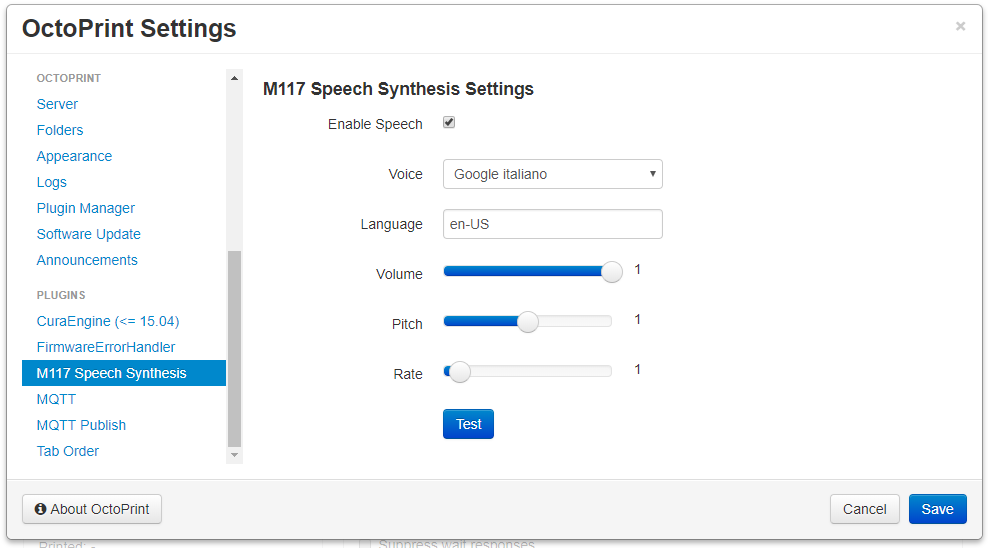

# OctoPrint-M117SpeechSynthesis

OctoPrint plugin to speak aloud M117 gcode messages when the web ui is loaded.

**Note: this plugin does NOT work with files on the SD card. Requires modern day browsers that support Speech Synthesis, check compatibility table [here](https://developer.mozilla.org/en-US/docs/Web/API/SpeechSynthesisUtterance#Browser_compatibility).**

### Setup

Install via the bundled Plugin Manager or manually using this URL:

https://github.com/jneilliii/OctoPrint-M117SpeechSynthesis/archive/master.zip

## Changelog

### [0.3.0] - 2018-01-22
- UI tweaks and additional browser checks

### [0.2.0] - 2018-01-20
- Added language code option in settings

### [0.1.0] - 2018-01-17
- Initial release.

[0.3.0]: https://github.com/jneilliii/OctoPrint-M117SpeechSynthesis/tree/0.3.0
[0.2.0]: https://github.com/jneilliii/OctoPrint-M117SpeechSynthesis/tree/0.2.0
[0.1.0]: https://github.com/jneilliii/OctoPrint-M117SpeechSynthesis/tree/0.1.0